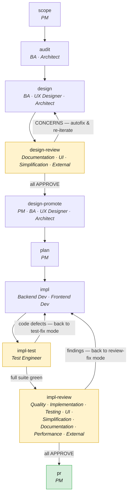

# ASD — Agentic Software Development

A multi-agent workflow for **Claude Code and Codex** that drives software projects end-to-end through fixed-shape sprints: from concept and tech-stack definition, through design and review, all the way to a green PR.

ASD is **stack-agnostic** — it works on any language, framework, or runtime. The workflow itself never touches your application code directly; it dispatches 15 specialized agents (PM, BA, UX Designer, Architect, devs, reviewers) coordinated by 17 skills.

Both providers run from one canonical source under `.asd/` (agents, skills, hooks); `.asd/sync.js` generates each provider's own view (`.claude/`, `.codex/`, `.agents/skills/`) and keeps them in sync. See [`.asd/rules/providers.md`](.asd/rules/providers.md) for the canonical/provider path map and semantic-operation mapping.

---

## Why use it

- **Repeatable structure.** Every sprint follows the same 10 phases — no improvisation, no forgotten steps.
- **Documentation that stays alive.** Persistent docs (concept, stack, ADRs, UX) update on every sprint instead of rotting.
- **Reviews that converge.** Iteration severity floor stops reviewers from nitpicking the same low-severity issue forever. Each iteration dispatches reviewers with clean context, so verdicts aren't biased by the authoring that produced the artifact. Each internal reviewer must return a complete coverage ledger — every scoped file and every checklist rule accounted for — and the phase skill validates that full ledger before writing, rejecting and re-dispatching any reviewer whose ledger is incomplete, so no file or rule is skipped silently. Only a coverage summary line, the full n/a list, and non-passing rows are persisted to the review file — the gate runs on the full returned ledger regardless.
- **Brownfield-friendly.** The audit phase reads any existing docs and code (in any format and location) and reverse-engineers them into the workflow's structure.
- **One source of truth.** SSoT iron rule is enforced by a dedicated Documentation reviewer.
- **Subsystem-aware.** Optional LikeC4 (or Mermaid) registry organises persistent docs per subsystem.

---

## Requirements

- **Claude Code and/or Codex CLI** — pick one as your primary runtime, or use both; ASD generates a working provider view for each
- **Node.js** — used by the SessionStart hook, `.asd/sync.js`, and by the optional Google Labs `designmd` and `LikeC4` CLIs
- **Git** — required (sprint = branch)
- **gh CLI** — optional, only if you want ASD to open PRs for you

Codex shows up twice, in two different roles — don't conflate them:

- **Codex as your primary runtime** — run sprints from Codex itself, driven by the generated `.codex/agents/*.toml` + `.agents/skills/` view of the same canonical workflow.
- **Codex CLI as the External Review tool** — when running under Claude Code, ASD shells out to Codex CLI as a second opinion during design-review/impl-review (and symmetrically, Claude CLI is wrapped when running under Codex). This works independently of which provider is your primary runtime.

Optional external tools auto-detected by `/asd-init`:

- **LikeC4 CLI** — for C4 architecture model rendering (subsystem-decomposition mode `likec4`)
- **`@google/design.md`** — for DESIGN.md token lint and Tailwind/DTCG export
- **Codex CLI** — for parallel external code review (see above)

---

## Install

Clone ASD into the root of your project (NOT into a subdirectory):

```bash
cd /path/to/your-project
git clone https://github.com/<owner>/agentic-software-development.git .asd-tmp
cp -R .asd-tmp/.asd .asd-tmp/.claude .asd-tmp/.codex .asd-tmp/.agents .
rm -rf .asd-tmp
```

Or, if your project is empty:

```bash
git clone https://github.com/<owner>/agentic-software-development.git my-project
cd my-project
rm AGENTS.md CLAUDE.md README.md   # these belong to the ASD repo, not your project
```

> **Do not copy this repo's `AGENTS.md`/`CLAUDE.md` into your project.** They document how to develop the ASD framework itself and are meaningless in a consumer project. Your project's `AGENTS.md`/`CLAUDE.md` are generated by `/asd-init` from `.asd/templates/t_AGENTS.md`/`t_CLAUDE.md` — do not create them by hand.

After cloning, open the project in Claude Code or Codex. The SessionStart hook prints a summary in the invocation form for whichever provider you're in — Claude Code: `[ASD] No active sprint. Run /asd-sprint to begin, or /asd-init to set up the workflow.`; Codex: `[ASD] No active sprint. Run $asd-sprint to begin, or $asd-init to set up the workflow.`

**Provider setup:** the `.claude/` and `.codex/`/`.agents/` trees above are pre-generated from `.asd/` canon, so both providers work immediately after cloning — run `node "$(git rev-parse --show-toplevel)/.asd/sync.js" --check` any time to verify they're still in sync (`/asd-sync` if not) — self-locating, works from any directory in the repo (a bare `node .asd/sync.js` only resolves from the repo root). Codex additionally requires trusting the project's `.codex/hooks.json` before its hooks run; `/asd-init` warns about this on first setup.

---

## Updating ASD

Once installed, pull newer framework versions without re-cloning. Run inside Claude Code:

```
/asd-update
```

This fetches the latest framework files from the ASD repo's `main` branch and replaces **only framework-managed paths** — your project keeps everything it owns.

| Updated (overwritten) | Never touched |
|---|---|
| `.asd/rules/`, `.asd/templates/` | `.asd/project/` (your config, custom rules) |
| `.asd/agents/`, `.asd/skills/`, `.asd/workflows/`, `.asd/hooks/`, `.asd/sync.js` | `.asd/sprints/` (your sprint work) |
| `.asd/release-manifest.json` itself | `docs/` (your persistent docs) |
| | `AGENTS.md`, `CLAUDE.md`, `.claude/settings.json`, `.codex/hooks.json` |
| | your own custom skills / agents / hooks |

The managed set is the SSoT list in `.asd/release-manifest.json`'s `managed_paths` (installed by the steps above), walked recursively file-by-file with a per-file conflict check — a file you hand-edited since the last update is never silently overwritten. Your own custom skills/agents/hooks living beside the managed set are never touched.

**How it stays safe:** the updater fetches and classifies every managed file *before* it writes or deletes anything, and skips any unresolved conflict.

**Preview first** — list what would change without writing:

```bash
node "$(git rev-parse --show-toplevel)/.asd/skills/asd-update/update.js" --dry-run
```

That command is also the manual fallback if you prefer running it outside Claude Code — self-locating, so it works from any directory in the repo. It needs `tar` on PATH (bundled with Windows 10 1803+, macOS, Linux) and Node >= 16.7.

After a successful update, it automatically runs `node .asd/sync.js --check` — canon files changed upstream mean the generated provider views (`.claude/`, `.codex/`, `.agents/skills/`) are now stale. Run `/asd-sync` (or `node .asd/sync.js --apply <file...>`) to regenerate them.

> **After updating, reconcile `.claude/settings.json` and `.codex/hooks.json` yourself.** They hold your permission allowlist and hook registration; the updater and sync only ever merge in their own hook entries, never rewrite the rest of the file. If an update added a hook or skill, you may need to register it there manually.

This repo (the ASD framework source itself) runs `node .asd/sync.js --check` in CI on every push/PR to `main` (`.github/workflows/sync-check.yml`), failing the build if any generated provider-view file drifts from canon.

---

## Quick start

```text
/asd-init           # interactive setup: language, decomposition mode, OS, tools, git
/asd-concept        # define the project concept (vision, users, value)
/asd-stack          # define the tech stack (architect proposes from concept)
/asd-design-system  # define the design system (tokens, components, a11y) — optional, also auto-gated in the design phase
/asd-sprint         # start your first sprint
```

`/asd-sprint` then walks you through the ten sprint phases automatically, pausing for your approval at every checkpoint.

---

## Workflow overview

Each sprint runs through ten mandatory phases in order:



`impl`, `impl-test`, and `impl-review` form one cycle. `impl` writes production code only — its gate is build + lint. `impl-test` then picks the test approach for the whole change scope (after the code exists), prunes tests that no longer earn their keep, writes the missing ones, and runs the full suite: code defects route back to `impl` (test-fix mode), a green suite advances to `impl-review`. Review findings route back to `impl` (review-fix mode) and return through `impl-test`. The `impl⇄impl-test` loop is uncapped — it ends on a green suite or an escalated blocker; `impl-review` keeps its iteration cap.

| Phase | What happens |
|---|---|
| **scope** | PM refines your raw idea into a coherent sprint goal; creates the sprint branch and folder |
| **audit** | BA + Architect scan existing docs and code; identify gaps, risks, stubs to resolve |
| **design** | BA writes PRD, UX Designer writes UX-spec and UI mockups, Architect writes ADRs and C4 schema |
| **design-review** | 3 internal reviewers (Documentation, UI, Simplification) plus External Review iterate to APPROVE |
| **design-promote** | Approved sprint drafts get decomposed per subsystem and promoted to persistent `docs/` |
| **plan** | PM decomposes work into Tasks with checkbox subtasks, traces each to PRD acceptance criteria |
| **impl** | Devs (Backend, Frontend) implement Tasks — or fix impl-review findings (review-fix mode) or impl-test defects (test-fix mode); no tests written here; run build/lint, commit per Conventional Commits |
| **impl-test** | Test Engineer picks the risk-based test approach for the change scope, deletes redundant/flaky/implementation-coupled tests, writes the missing ones, runs the full suite; records everything in `test-plan.md`; code defects route back to `impl` |
| **impl-review** | 7 internal reviewers (Quality, Implementation, Testing, UI, Simplification, Documentation, Performance) plus External Review; routes findings back to `impl` review-fix mode |
| **pr** | DoD verification + `gh pr create` (or push + summary if gh disabled); sprint folder archived onto the same branch right after; a later re-entry sets the terminal state once the PR is merged |

You can resume an interrupted sprint at any time: `/asd-sprint` reads `state.json`, detects the current phase, and dispatches the matching phase skill.

---

## Slash commands

User-facing commands available at any time. Invocation form differs per provider — same skill either way: Claude Code uses `/asd-*`, Codex uses `$asd-*` (or its `/skills` picker, or implicit description match):

| Claude Code | Codex | Purpose |
|---|---|---|
| `/asd-init` | `$asd-init` | Initialize the workflow, or edit settings later in diff mode |
| `/asd-concept` | `$asd-concept` | Form or edit `docs/product/concept.html` (4 entry variants: no-idea / vague / clear / brownfield) |
| `/asd-stack` | `$asd-stack` | Form or edit `docs/architecture/stack.html` (architect proposes from concept; same 4 variants) |
| `/asd-design-system` | `$asd-design-system` | Form or edit `docs/ux/DESIGN.md`, `design-system.html`, `accessibility.html` (3 entry variants: greenfield / constraints / brownfield) |
| `/asd-sprint` | `$asd-sprint` | Start a new sprint or resume the active one |
| `/asd-update` | `$asd-update` | Update framework infrastructure (rules, templates, ASD agents/skills/hooks) to the latest version from the ASD repo's main branch; never touches your config, sprints, persistent docs, or custom skills/agents/hooks |
| `/asd-sync` | `$asd-sync` | Reconcile generated provider views (`.claude/`, `.codex/`, `.agents/skills/`) with canonical `.asd/` sources — per-file overwrite/keep/diff confirmation, never a silent bulk overwrite |

Phase skills (`asd-phase-*`) are dispatched internally by `/asd-sprint`/`$asd-sprint`. You usually do not invoke them directly, but you can use them to re-run a specific phase of the active sprint.

---

## Agents

Fifteen specialized agents are canonically defined in `.asd/agents/` and generated per provider: `.claude/agents/*.md` for Claude Code, `.codex/agents/*.toml` for Codex. Each declares a model family alias per provider (Claude: fable/opus/sonnet/haiku; Codex: sol/terra/luna) plus a required reasoning effort; `.asd/sync.js` resolves aliases to concrete model ids via `.asd/release-manifest.json`'s `model_families` table (mirrored in [`.asd/rules/providers.md`](.asd/rules/providers.md)). Effort is shown as `model/effort`.

### Creators (7)

| Agent | Claude | Codex | Role |
|---|---|---|---|
| `asd-pm` | opus/medium | sol/medium | Sprint orchestrator: state, phase routing, decisions-log, PR ops |
| `asd-ba` | opus/high | sol/high | Business analyst: PRD, audit on the docs side, acceptance criteria |
| `asd-ux-designer` | opus/high | sol/high | UX flows, UI mockups, DESIGN.md tokens, design-system.html |
| `asd-architect` | opus/high | sol/high | ADRs, C4 model, stack, API contracts, tech-reference docs |
| `asd-backend-dev` | sonnet/medium | terra/medium | Server/CLI/library code (no tests) |
| `asd-frontend-dev` | sonnet/medium | terra/medium | UI code (no tests; consumes DESIGN.md tokens) |
| `asd-test-engineer` | sonnet/medium | terra/medium | All tests: risk-based selection, pruning, authoring at every level, suite runs, manual verification specs |

### Reviewers (7 internal + 1 external)

Reviewers are read-only on every provider: the 7 internal Claude reviewer agents carry no `Write`/`Edit`/`Bash` in `tools`; their Codex counterparts set `sandbox_mode: "read-only"`. External Review is the one exception with `Bash` in its Claude `tools` (it necessarily needs a command-runner to invoke the wrapped CLI at all) — its read-only guarantee is instead enforced explicitly on the WRAPPED subprocess itself: `codex exec --sandbox read-only` when running under Claude Code, `claude -p ... --allowedTools "Read,Grep,Glob"` when running under Codex. Every reviewer returns its verdict as final text; the dispatching phase workflow writes the review file.

| Agent | Claude | Codex | Phase(s) | Scope |
|---|---|---|---|---|
| `asd-reviewer-quality` | opus/high | sol/high | impl-review | Bugs, security, best-practice, contract drift |
| `asd-reviewer-implementation` | opus/high | sol/high | impl-review | PRD acceptance criteria coverage in code |
| `asd-reviewer-testing` | opus/high | sol/high | impl-review | `test-plan.md` decisions (risk fit, justified removals and no-test calls, fail-first proof), test quality, manual verification capture |
| `asd-reviewer-ui` | opus/high | sol/high | design-review + impl-review | UX-spec compliance, design-system tokens, a11y |
| `asd-reviewer-simplification` | opus/high | sol/high | design-review + impl-review | Over-engineering (13-item checklist) + structure/cohesion (god/sprawling type) detection |
| `asd-reviewer-documentation` | opus/high | sol/high | design-review + impl-review | SSoT integrity, template adherence, traceability |
| `asd-reviewer-performance` | opus/high | sol/high | impl-review | Perf budgets, regression, anti-patterns |
| `asd-external-review` | fable/high | sol/high | both | Wraps the *other* provider's CLI (Codex CLI under Claude Code, Claude CLI under Codex), parses output, applies severity floor |

Reviewers emit a machine-parseable first-line verdict token: `[REVIEW-<phase>-<reviewer>]: APPROVE|CONCERNS|FAIL`, where `<phase>` is `design` or `impl`.

---

## Configuration

All settings live in `.asd/project/config.yaml`, generated by `/asd-init`:

```yaml
self_hosting: disabled   # enabled | disabled — ASD developing itself through its own workflow

documents:                # optional sprint documents; absent group = all enabled (back-compat)
  audit: enabled           # <sprint>/audit.md
  prd: enabled              # design/prd.html + persistent requirements
  ux_spec: enabled          # ux-spec, design-system gate, design-md-delta
  adr: enabled               # adr.html + persistent ADR
  c4: enabled                  # c4-full + persistent C4 (also needs project.subsystem_decomposition: enabled)

language:
  chat: en          # language for chat with you
  docs: en          # language for user-facing artifacts

project:
  subsystem_decomposition: enabled    # enabled | disabled
  diagram_tool: likec4                # likec4 | mermaid (only when decomposition enabled)

backward_compat: migration            # strict | migration | none

review:
  external_review: enabled            # enabled | disabled
  iterations_low: 1                   # cumulative-budget severity floor
  iterations_medium: 1
  iterations_high: 2
  iterations_critical: 10

system:
  os: linux                           # windows | linux | macos
  tools:
    likec4: "likec4"                  # empty string disables likec4 generation
    designmd: true                    # availability flag; actual commands live in .asd/project/commands.yaml
    codex_command: ""                 # override when wrapping Codex under Claude Code
    claude_command: ""                # override when wrapping Claude CLI under Codex

git:
  base_branch: main
  branch_pattern: "sprint/{n}-{slug}"
  gh_enabled: true
  auto_pr: true
```

Re-run `/asd-init` to edit any section in diff mode.

---

## Folder structure

After `/asd-init`, your project looks like:

```
your-project/
├── .asd/                            # canonical source — SSoT for the whole workflow
│   ├── release-manifest.json        # schema/asd version, managed-path list, model-family table; drives /asd-update + sync.js
│   ├── sync-state.json              # last-written digests for managed-block / JSON-merge targets (committed)
│   ├── sync.js                      # generator: canon -> .claude/ + .codex/ + .agents/skills/ (--check / --apply)
│   ├── rules/                       # workflow rules (read by all agents on both providers), incl. providers.md
│   ├── templates/                   # artifact templates (t_*.html / .md / .yaml / .c4), incl. t_AGENTS.md / t_CLAUDE.md
│   ├── agents/                      # 15 canonical agent specs (JSON frontmatter: claude{} + codex{} blocks)
│   ├── skills/                      # 17 canonical skill specs (SKILL.md)
│   ├── workflows/                   # 10 phase orchestration files (referenced by path, not generated)
│   ├── hooks/                       # canonical session-start.js (--provider claude|codex)
│   ├── project/
│   │   ├── config.yaml              # workflow settings
│   │   ├── commands.yaml            # build/test/lint/run + design.md lint
│   │   ├── custom-common-rules.md   # universal rules — all agents, all phases
│   │   ├── custom-design-rules.md   # design / design-review rules
│   │   ├── custom-coding-rules.md   # impl / impl-test / impl-review rules (incl. perf budgets)
│   │   └── stubs.md                 # project-global TODO registry
│   └── sprints/
│       ├── <NNN-slug>/              # active sprint (one at a time); decisions-log.md created here at scope, archived with the sprint
│       └── archived/<NNN-slug>/     # moved here on PR open (pre-merge); read-only except the terminal write on merge
├── .claude/                         # generated Claude Code view
│   ├── agents/                      # 15 agent definitions (*.md)
│   ├── skills/                      # 17 skill definitions (SKILL.md)
│   ├── hooks/                       # SessionStart hook (Node.js)
│   └── settings.json                # hook registration + permissions allowlist (JSON-merge: ASD owns only its own entry)
├── .codex/                          # generated Codex view
│   ├── agents/                      # 15 agent definitions (*.toml)
│   ├── hooks/                       # SessionStart hook (Node.js)
│   └── hooks.json                   # hook registration (JSON-merge: ASD owns only its own entry); requires trust before hooks run
├── .agents/
│   └── skills/                      # 17 skill definitions for Codex (SKILL.md) — Codex only reads skills from here, not .codex/
├── docs/                            # persistent docs (grow across sprints)
│   ├── product/
│   │   ├── concept.html
│   │   └── requirements/<subsystem>.html
│   ├── architecture/
│   │   ├── stack.html
│   │   ├── c4/                      # subsystem registry (likec4 model or mermaid yaml)
│   │   ├── adr/<subsystem>/adr-NNNN-<slug>.html
│   │   ├── api/<subsystem>.html
│   │   └── tech-reference/<tech>-<version>.md
│   └── ux/
│       ├── DESIGN.md                # Google Labs format token source
│       ├── design-system.html       # rendered live preview
│       ├── accessibility.html
│       └── <subsystem>.html         # ux-spec per subsystem
├── AGENTS.md                        # SSoT rules hub, read by both providers
├── CLAUDE.md                        # thin: managed block importing @AGENTS.md
├── README.md                        # this file
└── <your project source>
```

`.asd/` is canonical and hand-edited; `.claude/`, `.codex/`, and `.agents/skills/` are generated by `.asd/sync.js` and committed so the project works immediately after checkout — never hand-edit a generated file, edit its `.asd/` source and re-run sync.

When `project.subsystem_decomposition: disabled`, persistent docs go to flat project-wide paths (no `<subsystem>/` subdirectories, no `c4/`).

The authoritative path map lives in [`.asd/rules/artifact-layout.md`](.asd/rules/artifact-layout.md).

---

## External tools (optional)

ASD works without any of these, but they unlock specific features.

### LikeC4 CLI

Renders interactive C4 architecture diagrams from text-DSL sources. Required when `project.diagram_tool: likec4`.

```bash
npm install -g @likec4/cli
likec4 --version
```

If absent, choose `diagram_tool: mermaid` instead — ASD will render architecture views as embedded Mermaid C4 blocks.

### `@google/design.md`

Lints and exports the DESIGN.md design-system source to Tailwind / W3C DTCG tokens.

```bash
# Linux/macOS
npx @google/design.md spec

# Windows (use the alias — npx fails on .md file association)
npm install -g @google/design.md
designmd --version
```

### Codex CLI / Claude CLI

Enables External Review in parallel with internal reviewers: install **Codex CLI** if Claude Code is your primary runtime, or **Claude CLI** if Codex is your primary runtime — External Review always wraps the *other* provider's CLI, never its own host's. ASD auto-skips and logs to the decisions log if the wrapped CLI is unavailable, so the workflow keeps running.

---

## Customization

### Custom rules

`/asd-init` creates three scoped rule files in `.asd/project/`. Agents read only what matches their phase, keeping irrelevant rules out of context:

- `custom-common-rules.md` — universal (domain glossary, naming, compliance). Read by every agent in every phase; pointed to from `AGENTS.md` as a "read this file" instruction, not an `@`-import (Codex has no import mechanism — plain hierarchical concatenation up to `project_doc_max_bytes`, per its own AGENTS.md docs). Both providers read `AGENTS.md` directly; `CLAUDE.md` is Claude-only and still uses `@AGENTS.md` (Claude Code's own import syntax, meaningless to Codex).
- `custom-design-rules.md` — design / design-review only (PRD format, ADR sections, UX constraints). Read by `asd-ba`, `asd-ux-designer`, `asd-architect`, design-review reviewers, and external review (design).
- `custom-coding-rules.md` — impl / impl-test / impl-review only (forbidden libraries, perf budgets, security policy, testing constraints). Read by dev/test agents, impl-review reviewers, and external review (impl).

Reviewers active in both phases (`documentation`, `ui`, `simplification`, `external-review`) load the phase-scoped file matching the dispatching phase.

### Hooks

The canonical SessionStart hook (`.asd/hooks/session-start.js`) prints a one-block summary of your active sprint into context on every session resume. It's generated per provider — `.claude/hooks/session-start.js` (wired via `.claude/settings.json`) and `.codex/hooks/session-start.js` (wired via `.codex/hooks.json`) — invoked with `--provider claude|codex`. Fails silently if Node is unavailable.

### Settings.json / hooks.json

`.claude/settings.json` pre-allows common git / gh / likec4 / designmd / codex commands so Claude Code does not prompt you for permission each time; edit its `permissions.allow` array to extend. `.codex/hooks.json` registers the same hook for Codex. Both files are JSON-merge targets — ASD owns only its own hook entry in each, never the rest of the file.

---

## FAQ

**Can I run multiple sprints in parallel?**
No. ASD enforces one active sprint at a time. The sprint folder is archived onto the branch right after its PR is opened, but it still counts as active — and blocks a new one — until the PR is actually merged (re-run `/asd-sprint` after merging to write the terminal state). This keeps state recovery simple.

**What if a reviewer keeps blocking the same finding?**
The iteration severity floor uses cumulative budgets: by default iter 1 considers all severities, iter 2 considers medium+, iter 3-4 considers high+, iter 5-14 considers only critical, iter 15+ escalates to you. Tune the limits in `config.yaml`.

**What if I disagree with a reviewer's FAIL verdict?**
FAIL findings trigger an explicit user-approval prompt (Complication Approval format). You can override or accept; the workflow records your decision in `decisions-log.md`.

**Can I skip the audit phase on greenfield projects?**
`documents.audit` defaults to `enabled` for backward compatibility, and it runs fast on empty projects (no existing code or docs to scan) — so most greenfield projects never need to touch it. Set `documents.audit: disabled` in `config.yaml` before a sprint's `scope` phase to make audit a no-op for that sprint (see "Can I skip PRD/UX-spec/ADR/C4 for a lean sprint?" above).

**Does ASD work without subsystem decomposition?**
Yes. Set `project.subsystem_decomposition: disabled` during `/asd-init`. Persistent docs become flat project-wide files. No C4 registry is maintained.

**Can I skip PRD/UX-spec/ADR/C4 for a lean sprint?**
Yes. Each is independently toggleable under `documents.*` in `config.yaml`, frozen into the sprint's `state.json` at scope time (a later config edit never changes an active sprint's rules). A phase whose entire applicable-artifact set is empty for the sprint (design, design-review, design-promote — and audit, via `documents.audit`) becomes a fast no-op: it advances immediately, writes nothing, with one skip line in the decisions log. `plan`/`impl`/`impl-test`/`impl-review`/`pr` always run; acceptance criteria then come from `sprint.md`'s own `AC-N` list instead of the PRD. See `.asd/rules/sprint-lifecycle.md` "Optional documents".

**Can ASD develop itself?**
Yes — set `self_hosting: enabled` in `config.yaml` (this repo ships with it enabled, `documents.audit` only). `/asd-sprint` then edits ASD's own canonical `.asd/rules/`, `.asd/templates/`, `.asd/agents/`, `.asd/skills/`, `.asd/workflows/`, `.asd/hooks/`, `.asd/sync.js`, plus `README.md`/`AGENTS.md`/`tests/**` — generated `.claude/`/`.codex/`/`.agents/skills/` stay off-limits, resynced via `node .asd/sync.js --apply` after every canon edit. Root `AGENTS.md` stays self-sourced (never replaced by `t_AGENTS.md`), and `/asd-update` refuses to run (it pulls framework files INTO a consumer; a self-hosting repo IS the framework). See `.asd/rules/sprint-lifecycle.md` "Self-hosting".

**What if my project already has an AGENTS.md or CLAUDE.md?**
Either works. `/asd-init` adds ASD's rules as a managed block (`<!-- asd:begin -->...<!-- asd:end -->`) inside your existing `AGENTS.md`/`CLAUDE.md`, leaving the rest of your file untouched; if either file doesn't exist yet, it's created from `.asd/templates/t_AGENTS.md`/`t_CLAUDE.md`. Either way, do not reuse the `AGENTS.md`/`CLAUDE.md` from the ASD repo itself — those document how to develop the framework and are meaningless in a consumer project.

**Where do TODO stubs live?**
Project-globally in `.asd/project/stubs.md`; it holds only open stubs, and a stub is deleted on resolution. The registry persists across sprint archival. The PR phase blocks if any stub introduced by the current sprint remains unresolved without an `(accepted-debt)` Reason prefix.

---

## License

[MIT](LICENSE)

---

## Acknowledgments

ASD draws on practices and patterns from:

- [LordKuper/agentic-game-studio](https://github.com/LordKuper/agentic-game-studio) — sprint structure, reviewer roster, severity floor concept, brainstorm entry variants
- [Google Labs DESIGN.md](https://github.com/google-labs-code/design.md) — design-system source format
- [LikeC4](https://likec4.dev) — text-DSL architecture diagrams
- [Agent Skills specification](https://agentskills.io/specification) — SKILL.md format
- [Anthropic skills best practices](https://platform.claude.com/docs/en/agents-and-tools/agent-skills/best-practices) — description writing, progressive disclosure
- [DenisSergeevitch/agents-best-practices](https://github.com/DenisSergeevitch/agents-best-practices) — operating contracts, narrow tool whitelists, draft-vs-commit split
